# Credit_Risk_Analysis

## Analysis Overview

### Apply machine learning to solve a real-world challenge: credit card risk.
Credit risk is an inherently unbalanced classification problem, as good loans easily outnumber risky loans. We need to employ different techniques to train and evaluate models with unbalanced classes. We will use the imbalanced-learn and scikit-learn libraries to build and evaluate models using resampling.
  
Using the credit card credit dataset from LendingClub, a peer-to-peer lending services company, we oversample the data using the RandomOverSampler and SMOTE algorithms, and undersample the data using the ClusterCentroids algorithm. Then, we use a combinatorial approach of over- and undersampling using the SMOTEENN algorithm. Next, we compare two new machine learning models that reduce bias, BalancedRandomForestClassifier and EasyEnsembleClassifier, to predict credit risk. 
 

## Analysis Results

### RandomOverSampler 

- Balanced accuracy score: 64.94%
- Confustion Matrix: 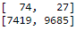
- Classification Report  

### SMOTE
- Balanced accuracy score: 65.84%
- Confustion Matrix: 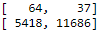
- Classification Report  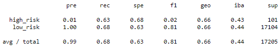

### ClusterCentroids
- Balanced accuracy score: 54.42%
- Confustion Matrix: 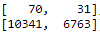
- Classification Report  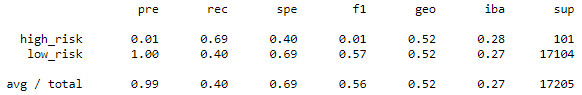

### SMOTEENN
- Balanced accuracy score: 66.22%
- Confustion Matrix: 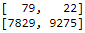
- Classification Report  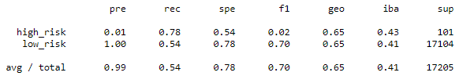

### BalancedRandomForestClassifier
- Balanced accuracy score: 78.85%
- Confustion Matrix: 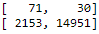
- Classification Report  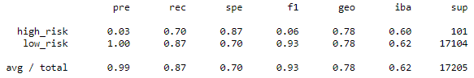

### EasyEnsembleClassifier
- Balanced accuracy score: 93.17%
- Confustion Matrix: 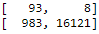
- Classification Report  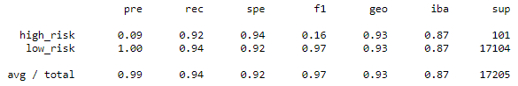

## Analysis Results
### Accuracy 
- Our EasyEnsembleClassifier model has by far the highest accuracy score at 93.17%. It is important to mention that this is not necessarily a meaningul metric. For example: if a model predicted only "low_risk" for it's y value and never predicted "high_risk" it would have a higher accuracy (99.41%). 

### Precision
- Again our EasyEnsembleClassifier model outperforms the other models with a precision score of 8.64%. This means that when our BEST model predicts our y value to be "high_risk" it is correct less than 9% of the time. 

### Sensitivity/Recall
- Yet again our EasyEnsembleClassifier model outperforms the other models with a recall score of 92.08%. This means that when the actual y value is "high_risk" this model will accurately predict the value over 92% of the time. 

### Conclusion
- Further analysis needed. Although the EasyEnsembleClassifier outperforms it's competing models in every metric we do not know if using this model put us in a better position than the status quo. Would we inadvertently negatively impact our bottom line in the future by not lending to accounts that meet the "hight_risk" criteria of the model?
	- What is our risk appetite? 
	- What is our appetite for return? 
	- What is the rate of return for the population as a whole? 
	- What is the rate of return for the records we are marking as "high_risk"?
	- How would these "high_risk" and "low_risk" populations be impacted differently in a potential economic downturn? 

