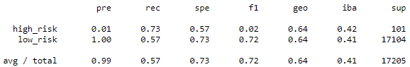

# Credit_Risk_Analysis

## Analysis Overview

### Apply machine learning to solve a real-world challenge: credit card risk.
Credit risk is an inherently unbalanced classification problem, as good loans easily outnumber risky loans. We need to employ different techniques to train and evaluate models with unbalanced classes. We will use the imbalanced-learn and scikit-learn libraries to build and evaluate models using resampling.
 
Using the credit card credit dataset from LendingClub, a peer-to-peer lending services company, we oversample the data using the RandomOverSampler and SMOTE algorithms, and undersample the data using the ClusterCentroids algorithm. Then, we use a combinatorial approach of over- and undersampling using the SMOTEENN algorithm. Next, we compare two new machine learning models that reduce bias, BalancedRandomForestClassifier and EasyEnsembleClassifier, to predict credit risk. 
 

## Analysis Results

### RandomOverSampler 

- Classification Report  
- Balanced accuracy score: 64.94%

### SMOTE

### ClusterCentroids

### SMOTEENN

### BalancedRandomForestClassifier

### EasyEnsembleClassifier

## Analysis Results